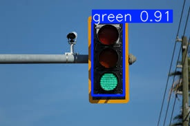

# YOLOv11 ile Trafik Işığı ve Rengi Tanıma

## Tanıtım 
Bu proje, YOLOv11 derin öğrenme modelini kullanarak resimlerdeki trafik ışıklarını ve renklerini algılayan bilgisayarlı görü uygulamasıdır.

YOLOv11 modeli, gerçek zamanlı nesne tanıma ve sınıflandırma özelliklerine sahip bir derin öğrenme modelidir. Bu proje özellikle trafik ışıklarını ve kırmızı, sarı veya yeşil renklerinden hangisinin yandığını ayırt etmeye yarar.

## Eğitim Detayları

### Veri Seti
Projenin eğitiminde `cinTA_v2` veri seti kullanılmıştır. 
Bu veri setinde `2397` tane `Red`, `Yellow` ve `Green` olarak etiketlenmiş resim bulunmaktadır.

#### Ön İşleme
* `EXIF-orientation stripping`
* `416x416`

#### Augmentation
* Rastgele yatay veya dikey döndürme
* Rastgele kırpma
* Rastgele parlaklık değişimi
* Rastgele `exposure` değişimi
* Rastgele `Gaussian Blur` uygulaması

### Eğitim Süreci
| Parametre  | Açıklama                                                                             | Değer          |
|------------|--------------------------------------------------------------------------------------|----------------|
| Epoch      | Eğitimin süreceği tur sayısı                                                         | 200            |
| Patience   | Doğrulama metriklerinde herhangi bir değişiklik görülmeden harcanacak bekleme süresi | 100            |
| Batch      | Modelin tek seferde kaç parça veri birden alacağı                                    | 16             |
| Image Size | Resimlerin modele gönderilirkenki boyutu                                             | 640            |
| Device     | Eğitimin yapılacağı cihaz (CPU, GPU, TPU)                                            | 0 (Nvidia GPU) |

## Özellikler
Bu proje kapsamında eğittiğimiz model ile kullanıcıya eğitim ve nesne tanıma özellikleri sunduk. Kullanıcı dilerse modeli kullanarak hedef resim veya klasörde tanıma yapabilir veya kendi veri setini kullanarak modelin eğitimini sürdürebilir.


### Tanıma

Program kendisine verilen resim veya videoda tanıdığı trafik ışıklarının etrafına bir `bounding box` çizer ve ışığın rengine göre sınıflandırır.

***Şekil 1: Örnek Tanıma***



Programın tanımada kullanabildiği dosya uzantıları:
- .bmp
- .dng
- .jpeg
- .jpg
- .mpo
- .png
- .tif
- .tiff
- .webp
- .pfm
- .HEIC
- .asf
- .avi
- .gif
- .m4v
- .mkv
- .mov
- .mp4
- .mpeg
- .mpg
- .ts
- .wmv
- .webm

## Gereksinimler
- Git
- Python 3
- Nvidia GPU ve CUDA sürücüleri (Daha hızlı tanıma yapmak için gerekli)

## Kullanım

0) Programı yüklemek için repo aşağıdaki komut ile klonlanmalıdır:
    ```
    git clone 
    ```

1) Öncelikle programın olduğu dizinde bir terminal / komut istemi açılmalı veya

    ```
    cd "Proje dizini"
    ```
    komutuyla projenin dizinine geçilmelidir.

2) Gerekli kütüphaneleri yüklemek için

    ```
    pip install -r requirements.txt
    ```
    komutu çalıştırılmalıdır.

3) Son olarak programı çalıştırmak için
    ```
    python.exe ./detect.py "Hedef dosya veya dizin adı"
    ```
    komutu çalıştırılmalıdır.

# traffic_light_detection
